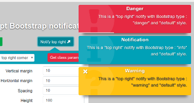

# BSNotify v0.1 
... under construction do not use ...

Simple class for displaying notification messages written in vanilla JavaScript.

See it in action at htp://www.dockfo.gr
How to use.

Instantiate the Notify class with notify = new Notify() and off you go. To display notifications call the method notify.show(). You can also override the class default parameters which are :
	
	notifyType	default: 'card'		values: ('card', 'block')
	hPosition	default: 'left'		values:	('left', 'right')
	vPosition	default: 'top'		values:	('top', 'bottom')
	insertPosition	default: 'first'	values:	('first', 'last')
	hMargin		default: 10		values:	(min: 10, max: 20)
	vMargin		default: 10		values:	(min: 10, max: 20)
	notifyHeight	default: 100		values:	('auto' or min: 100, max: 200)
	notifySpacing	default: 10		values:	(min: 5, max: 15)
	autoHide	default: true		values:	(true, false)
	autoHideInd	default: true		values:	(true, false)
	autoHideTime	default: 8000		values:	(min: 2000, max: 15000)
	hideOnClick	default: true		values:	(true, false) 
	showTransition	default: 'slide'	values:	('slide', 'elastic', 'jelly', 'drop')
	showDuration	default: 800		values:	(min: 400,  max: 1500)
	hideTransition	default: 'rocket'	values:	('rocket', 'slide')
	hideDuration	default: 800		values:	(min: 400,  max: 1500)
	
	notifyType	- notification type
	hPosition	- display notification on the left or on the right side of the document body
	vPosition	- display notification at the top or at the bottom of the document body
	insertPosition	- display new notifications first or last
	hMargin		- distance in pixels from the left or right margin of the document body
	vMargin		- distance in pixels from the top or bottom margin of the document body
	notifyHeight	- true for auto height or height in pixels
	notifySpacing	- vertical spacing between notification in pixels 
	autoHide	- autohide or manually close the notification
	autoHideInd	- displays, as progressive bar, the time remaining for closing the notification
	autoHideTime	- display duration in msec
	hideOnClick	- hide notification on click   
	showTransition	- name of the show transition 
	showDuration	- show transition duration in mscec
	hideTransition	- name of the hide transition
	hideDuration	- hide transition duration in mscec
					  
example:

	notify = new Notify({	notifyHeight : 'auto',
				hideDuration : 1500,
				autoHideTime : 2000,
				hPosition : 'left',
				vPosition : 'top'});

For the show() method you have to pass 2 parameters : 'message', 'notifyType', and (optionally) 'theme' 

	message		- your message to display
	notifyType	- type of notification ('primary', 'success', 'info', 'warning', 'danger')
	theme		- theme ('default')

example:

	notify.show({ title : 'my title', message : 'my message', align : 'center'}, 'warning', 'default')
	
After instantiating the class you can modify the parameters with the method setParams({...}) as follows :
	
	notify.setParams({	notifyHeight 	: 125,
				hideDuration 	: 800,
				autoHideTime 	: 8000,
				showTransition 	: 'jelly',
				hideTransition	: 'teleport'});

After instantiating the class you can't change the 'vPosition', 'hPosition' and the 'notifyType' but  you can instantiate new notification in other position.

